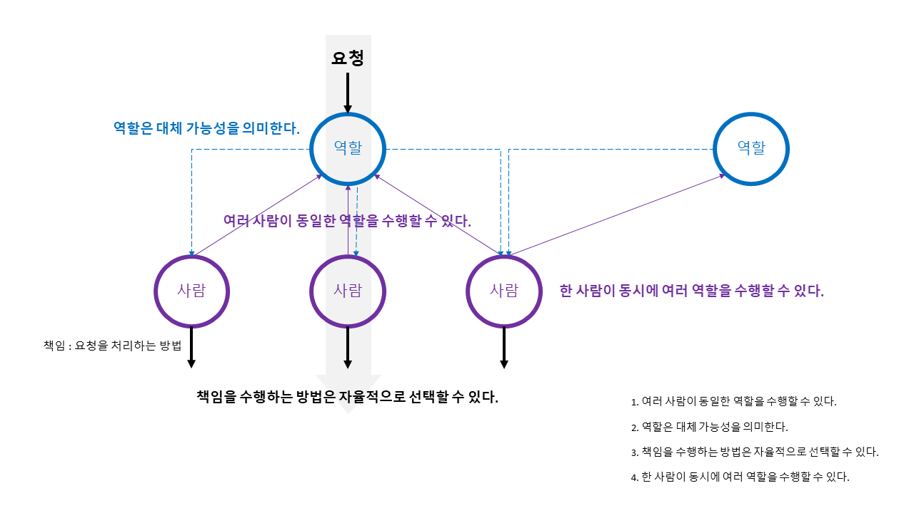

# 1. 협력하는 객체들의 공동체

## 객체지향은?
- 철학적 개념 : **실세계 모방**
  - 객체지향이란 실셰계를 직접적이고 직관적으로 `모델링`할 수 있는 패러다임이다.
  - 객체지향 소프트웨어는 실세계의 `투영`이며, 객체란 현실 세계에 존재하는 사물에 대한 `추상화`라는 것이다.
- 실용적 개념 : **새로운 세계 창조**
  - 고객과 사용자를 만족시킬 수 있는 신세계를 창조하는 것이다.

## 철학적 개념 vs. 실용적 개념
- 철학적 개념 : 객체지향 개념 이해와 교육
  | 실세계 | 실세계 모방 |
  | --- | --- |
  | 현실 세계의 생명체(상태와 행위 캡슐화)  | 객체의 자율성(Autonomous) |
  | 암묵적인 '역속'과 명시적인 '계약'을 기반으로 협력하며   목표를 달성해 나가는 과정 | '메시지'를 주고 받으며 공동의 목표를 달성하기 위해 '협력'하는   객체들의 관계 |
  - 철학적 개념(실세계의 모방)은 객체지향을 이해하고 학습하는 데는 매우 효과적이지만 객체지향 분석과 설계를 설명(실용적 개념)하기에는 부적합하다.
- 실용적 개념 : 객체지향 분석과 설계
  - 철학적 개념이 객체지향 분석과 설계에 부적한 이유는 객체와 사물 간의 개념적 거리는 유사성을 찾기 어려울 정도로 매우 먼 것이 일반적이다.  
    **※ 실계계와 객체의 개념적 거리가 가깝지 않다(유사성이 많지 않다).**

## 협력
- 협력 : 협력의 성공은 특정한 역할을 맡은 각 개인이 얼마나 요청을 성실히 이행하는가에 달려 있다.
- 역할 : 협력하는 과정 속에서 특정한 역할을 부여 받는다.
  - 어떤 **협력에** 참여하는 특정한 사람이 협력 안에서 차지하는 **책임이나 임무를 의미한다**.
  - 역할이라는 단어는 의미적으로 책임이라는 개념을 내포한다.
  - 특정한 역할은 특정한 책임을 암시한다.

## 협력의 주요 특징

1. 여러 사람이 동일한 역할을 수행할 수 있다.
1. 역할은 대체 가능성(Substituable)을 의미한다.
1. 책임을 수행하는 방법은 자율적으로 선택할 수 있다.
1. 한 사람이 동시에 여러 역할을 수행할 수 있다.