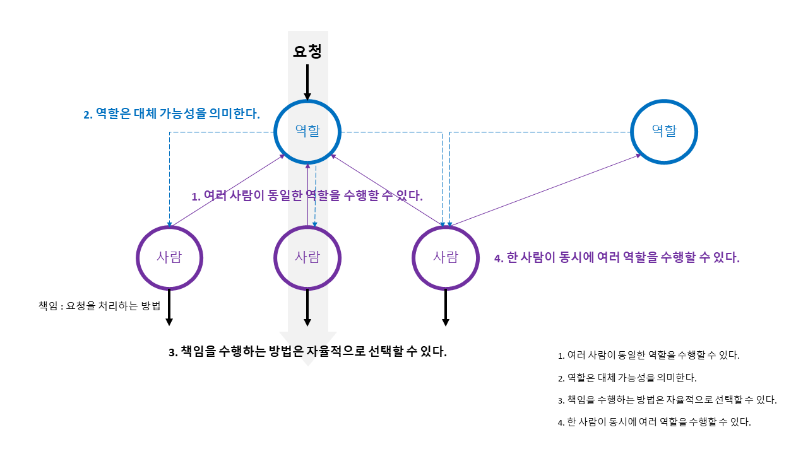

# 1. 협력하는 객체들의 공동체

## 객체지향은?
> 객체지향은 시스템을 상호작용하는 자율적인 객체들의 공동체로 바라보고 객체를 이용해 시스템을 분할하는 방법이다.
> - 협력적(상호작용) : 메시지
> - 자율적 : 캡슐화(상태와 행위 : 자율적 메서드 선택)
> - 단위(분할) : 객체

- 철학적 개념 : **실세계 모방**
  - 객체지향이란 실셰계를 직접적이고 직관적으로 `모델링`할 수 있는 패러다임이다.
  - 객체지향 소프트웨어는 실세계의 `투영`이며, 객체란 현실 세계에 존재하는 사물에 대한 `추상화`라는 것이다.
- 실용적 개념 : **새로운 세계 창조**
  - 고객과 사용자를 만족시킬 수 있는 신세계를 창조하는 것이다.

## 철학적 개념 vs. 실용적 개념
- 철학적 개념 : 객체지향 개념 이해와 교육
  | 실세계 | 실세계 모방 |
  | --- | --- |
  | 현실 세계의 생명체(상태와 행위 캡슐화)  | 객체의 자율성(Autonomous) |
  | 암묵적인 '역속'과 명시적인 '계약'을 기반으로 협력하며   목표를 달성해 나가는 과정 | '메시지'를 주고 받으며 공동의 목표를 달성하기 위해 '협력'하는   객체들의 관계 |
  - 철학적 개념(실세계의 모방)은 객체지향을 이해하고 학습하는 데는 매우 효과적이지만 객체지향 분석과 설계를 설명(실용적 개념)하기에는 부적합하다.
- 실용적 개념 : 객체지향 분석과 설계
  - 철학적 개념이 객체지향 분석과 설계에 부적한 이유는 객체와 사물 간의 개념적 거리는 유사성을 찾기 어려울 정도로 매우 먼 것이 일반적이다.  
    **※ 실계계와 객체의 개념적 거리가 가깝지 않다(유사성이 많지 않다).**
  - 협력(목표), 역할(객체), 책임(자율) : 애플리케이션의 기능 구현하기 위해 협력하는 객체(역할)를 식별하여 적절한 책임을 할당하는 것이다.
    - 객체지향 애플리케이션의 아름다움을 결정하는 것이 협력이라면 협력이 얼마나 조화를 이루는지를 결정하는 것은 객체다.  
      결국 협력의 품질을 결정하는 것은 객체의 품질이다.
    - 객체지향 설계라는 예술은 적절한 객체(역할)에게 적절한 책임을 할당하는 것에서 시작된다.  
      책임은 객체지향 설계의 품질을 결정하는 가장 중요한 요소다.

## 협력
- 협력 : 특정한 책임을 수행하는 역할들 간의 연쇄적인 요청과 응답을 통해 목표를 달성하는 것이다.
  - 협력의 성공은 특정한 역할을 맡은 각 개인이 얼마나 요청을 성실히 이행하는가에 달려 있다.
- 역할 : 협력하는 과정 속에서 특정한 역할을 부여 받는다.
  - 어떤 **협력에** 참여하는 특정한 사람이 협력 안에서 차지하는 **책임이나 임무를 의미한다**.
  - 역할이라는 단어는 의미적으로 책임이라는 개념을 내포한다.
  - 특정한 역할은 특정한 책임을 암시한다.
  - 역할은 관련성 높은 책임의 집합이다.

## 협력의 주요 특징

1. 여러 사람이 동일한 역할을 수행할 수 있다.
1. 역할은 대체 가능성(Substituable)을 의미한다.
1. 책임을 수행하는 방법은 자율적으로 선택할 수 있다.
1. 한 사람이 동시에 여러 역할을 수행할 수 있다.

## 협력 공동체의 객체 특징
### 1. 객체는 충분히 **'협력적'이어야 한다.**
> 객체는 오직 한 가지 의사소통 수단 '메시지'로 협력한다.
> - 다른 객체와 조화롭게 협력할 수 있을 만큼 충분히 개방적이어야 한다.
> - 객체는 다른 객체의 요청에 충실히 귀 기울이고 다른 객체에게 적극적으로 도움을 요청할 수 있어야 한다(능동적 존재).
- 객체지향의 세계에서 협력은 메시지를 전송하는 객체와 메시지를 수신하는 객체 사의 관계로 구성된다.

### 2. 객체는 충분히 **'자율적'이어야 한다.** 

> 객체는 상태(state)와 행위(behavior, 자율적 선택)을 함께 지닌 실체이다.
> - 협력에 참여하는 방법을 스스로 결정할 수 있어야 한다(어떤 방식으로 응답할지는 객체 스스로 판단하고 결정한다).  
- 자신의 상태를 직접 관리하고 상태를 기반으로 스스로 판단하고 행동할 수 있음을 의미한다.
  - 데이터(상태, state)와 프로세스(행위, behavior)를 객체라는 하나의 특 안에 함께 묶어 놓음으로써 객체의 자율성을 보장한다.
- 객체의 내부와 외부를 명확하게 구분해야 한다.
  - **객체의 외부(메시지)** : 객체는 다른 객체가 '무엇(WHAT)'을 수행하는지 알 수 있다.
  - **객체의 내부(메서드)** : 객체는 다른 객체가 '어떻게(HOW)' 수행하는지에 대해서는 알 수 없다(자율적).
- 메시지를 수신한 객체가 실행 시간에 메서드를 선택할 수 있다.  
  - 외부의 요청이 무엇인지를 표현하는 메시지와 요청을 처리하기 위한 구체적인 방법인 메서드를 분리하는 것은  
     객체의 자율성을 높이는 핵심 메커니즘이다.
  - 메시지와 메서드의 분리는 객체의 협력에 참여하는 객체들 간의 자율성을 증진시킨다.
  - 객체가 수신된 메시지를 처리하는 방법을 메서드(method)라고 부른다.
