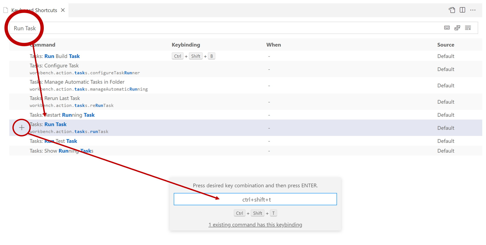

# 단위 테스트 VSCode 태스크

### Task 생성
```json
{
    "label": "tests",
    "command": "dotnet",
    "type": "process",
    "args": [
        "test"
    ],
    "problemMatcher": "$msCompile"
}
```


- `tasks.json` 파일
- `dotnet test` : 모든 단위 테스트 프로젝트 실행

### 단축키 생성


- Open Keyboard Shortcuts : Ctrl + K + S
  - Tasks: Run Task
    - `+`
    - 단축키 생성

### 단축키와 Task 연결


```json
// Place your key bindings in this file to override the defaultsauto[]
[
    {
        "key": "ctrl+shift+t",
        "command": "workbench.action.tasks.runTask",
        "args": "test"
    }
]
```
- C:\Users\{계정명}\AppData\Roaming\Code\User\keybindings.json
- `args` : Task의 label 입력
