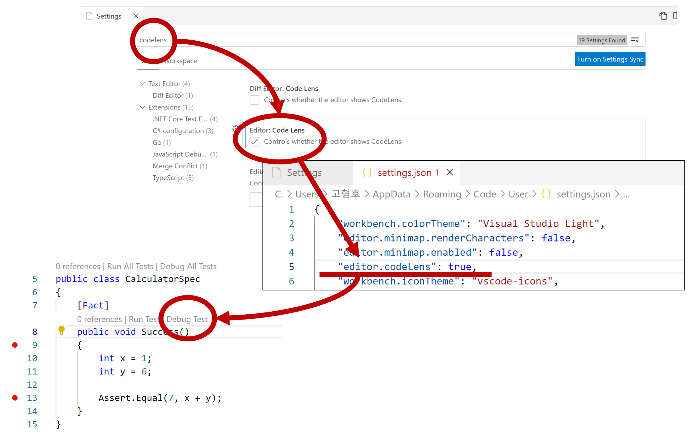
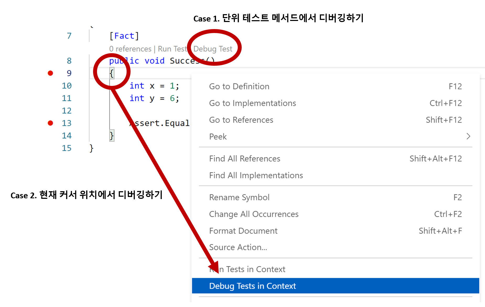
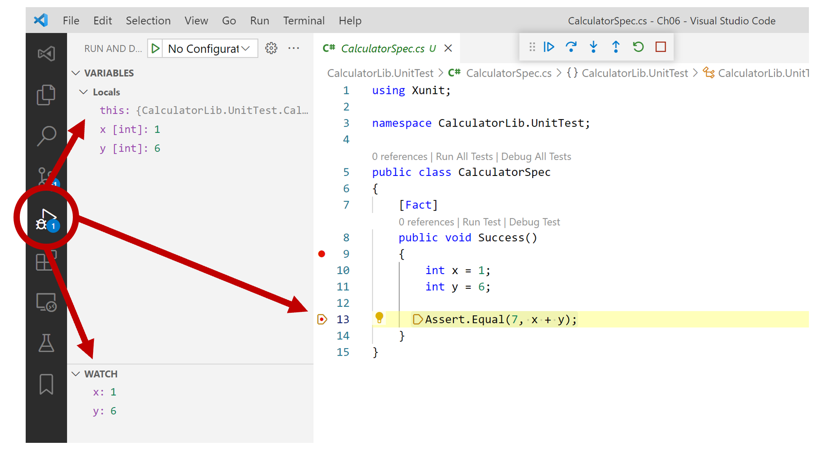

# 단위 테스트 디버깅

## VSCode 디버깅 설정 : Code Lens 활성화


## 단위 테스트 디버깅 방법

- Case 1. : `Code Lens`에서 "Debug Test"을 클릭한다.
- Case 2. : 커서의 현재 위치의 컨텍스트 메뉴 "Debug Tests in Context"을 클릭한다.

## VSCode 단위 테스트 디버깅


## `Microsoft.TestPlatform.PlatformAbstractions.dll` 복사 실패로 디버깅 못할 때
```
C:\Program Files\dotnet\sdk\6.0.100\Microsoft.Common.CurrentVersion.targets(4812,5):
  error MSB3021: Unable to copy file
  "C:\Users\{계정}\.nuget\packages\microsoft.testplatform.objectmodel\16.11.0\lib\netcoreapp2.1\Microsoft.TestPlatform.PlatformAbstractions.dll"
  to "bin\Debug\net6.0\Microsoft.TestPlatform.PlatformAbstractions.dll".

  The process cannot access the file 
  'c:\{프로젝트}\CalculatorLib.UnitTest\bin\Debug\net6.0\Microsoft.TestPlatform.PlatformAbstractions.dll'
  because it is being used by another process.
  [C:\{프로젝트}\CalculatorLib.UnitTest\CalculatorLib.UnitTest.csproj]
```
- `TestHost` 프로세스를 작업 관리자에서 강제 종료 시킨다.
  - [ProcessExplorer](https://docs.microsoft.com/ko-kr/sysinternals/downloads/process-explorer)을 통해 `Microsoft.TestPlatform.PlatformAbstractions.dll` 파일을 잡고있는 프로세스를 확인할 수 있다.
