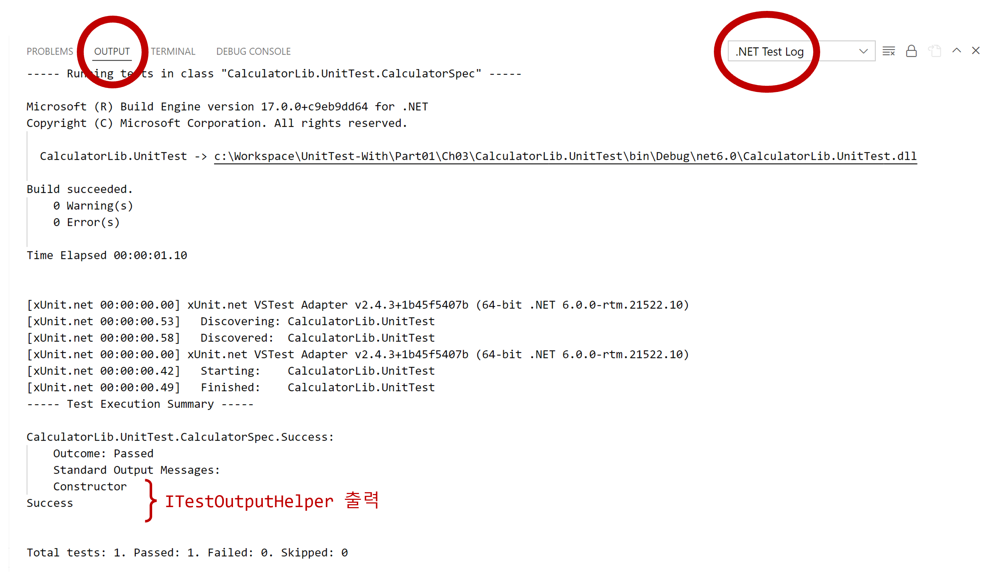
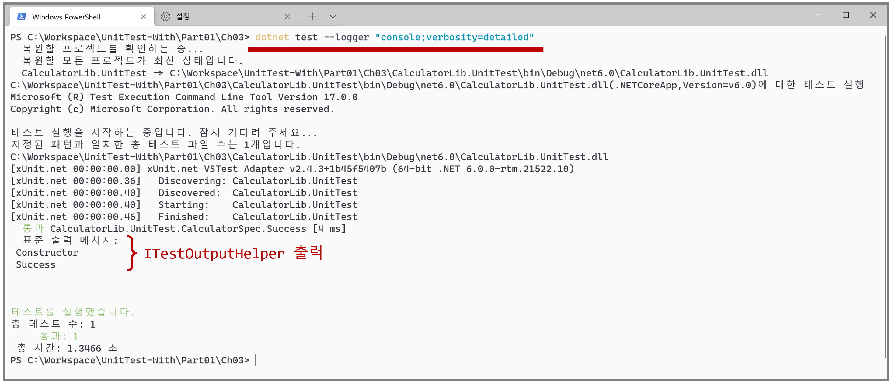

# 단위 테스트 출력

```cs
using Xunit;
using Xunit.Abstractions;

public class CalculatorSpec
{
    // 단위 테스트 출력 인터페이스
    private readonly ITestOutputHelper _output;

    // xUnit이 ITestOutputHelper을 생성자에게 자동으로 주입(전달)한다.
    public CalculatorSpec(ITestOutputHelper output)
    {
        _output = output;
        _output.WriteLine($"Constructor");
    }

    [Fact]
    public void Success()
    {
        _output.WriteLine($"Success");
    }
}
```
- 단위 테스트 출력은 `ITestOutputHelper` 인터페이스를 사용한다.
  - `ITestOutputHelper` 인터페이스는 `WriteLine` 메서드를 제공한다.
  - `ITestOutputHelper` 인터페이스 인스턴스는 생성자로 자동으로 주입(전달)된다.
  - `ITestOutputHelper` 인터페이스 출력은 VSCode에서 확인할 수 있다.

- VSCode 출력
  
- dotnet 출력 : `dotnet test --logger "console;verbosity=detailed"`
  