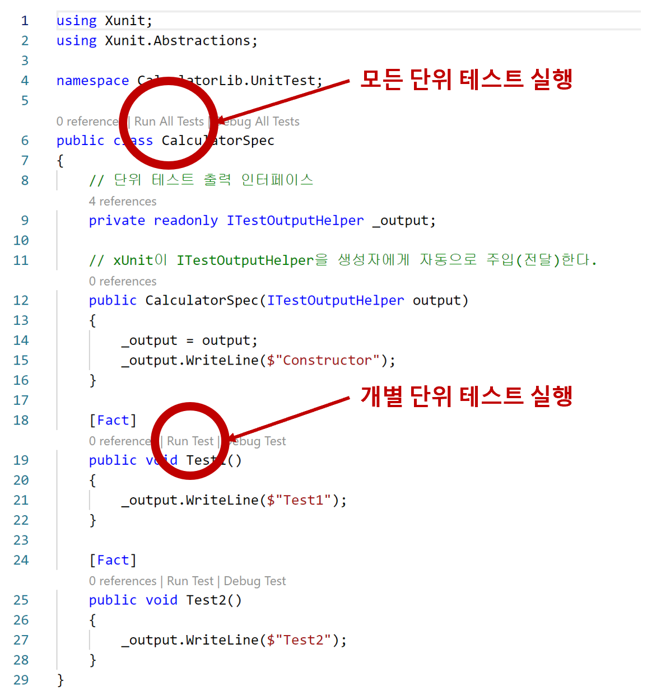
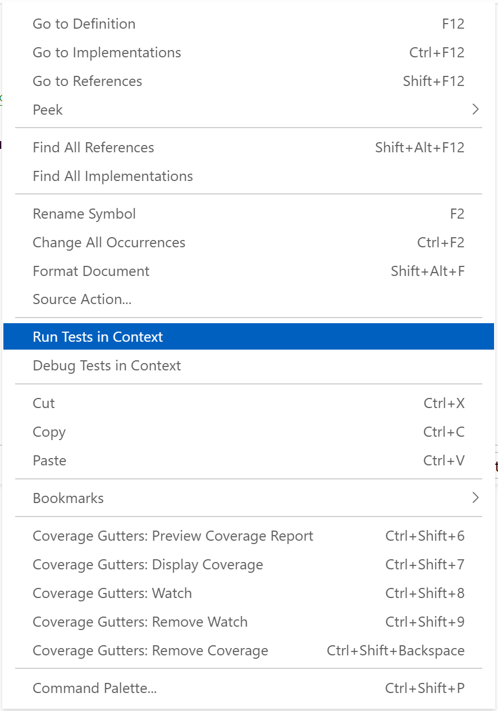

# 단위 테스트 격리 실행

`dotnet test --logger "console;verbosity=detailed"`  
```shell
----- Test Execution Summary -----

CalculatorLib.UnitTest.CalculatorSpec.Test2:
    Outcome: Passed
    Standard Output Messages:
    Constructor
    Test2

CalculatorLib.UnitTest.CalculatorSpec.Test1:
    Outcome: Passed
    Standard Output Messages:
    Constructor
    Test1

Total tests: 2. Passed: 2. Failed: 0. Skipped: 0
```
- 단위 테스트 메서드 단위로 단위 테스트 클래스를 생성한다.
  - **단위 테스트 클래스 생성자 : 단위 테스트 메서드 = 1 : 1" 관계를 갖는다.
  - 단위 테스트 메서드는 서로 독립된(격리된) 인스턴스로 실행한다.
- VSCode 모든 단위 테스트 실행하기 : CodeLens
  
  - settings.json 파일 : `"editor.codeLens": true,`
- VSCode 모든 단위 테스트 실행하기 : ContextMenu
  

