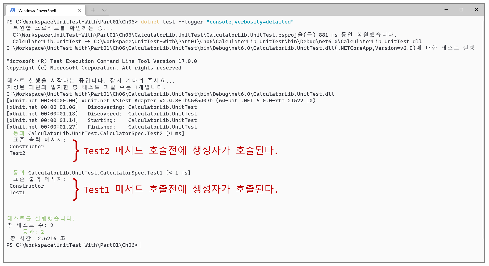
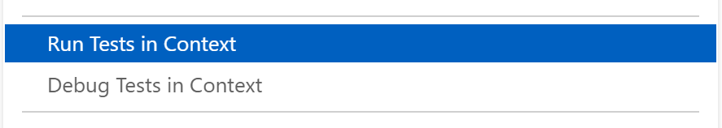

# 단위 테스트 격리 실행

- `dotnet test --logger "console;verbosity=detailed"`
- 모든 단위 테스트 메서드는 새 인스턴스에서 실행한다.
  - "단위 테스트 클래스 인스턴스 : 단위 테스트 메서드 = 1 : 1" 관계를 갖는다.
  - 단위 테스트 메서드는 서로 독립된(격리된 : 독립된 인스턴스) 인스턴스로 실행한다.
- VSCode 모든 단위 테스트 실행하기 : CodeLens
  
  - settings.json 파일 : `"editor.codeLens": true,`
- VSCode 모든 단위 테스트 실행하기 : ContextMenu
  

