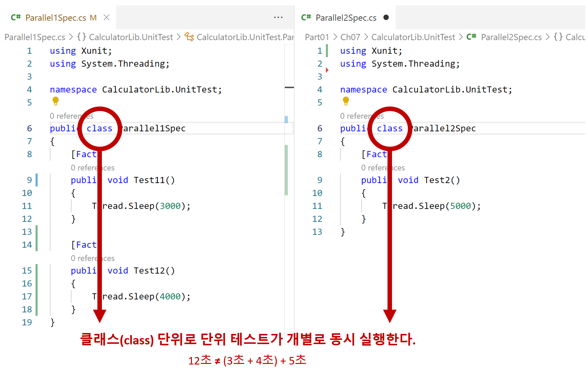
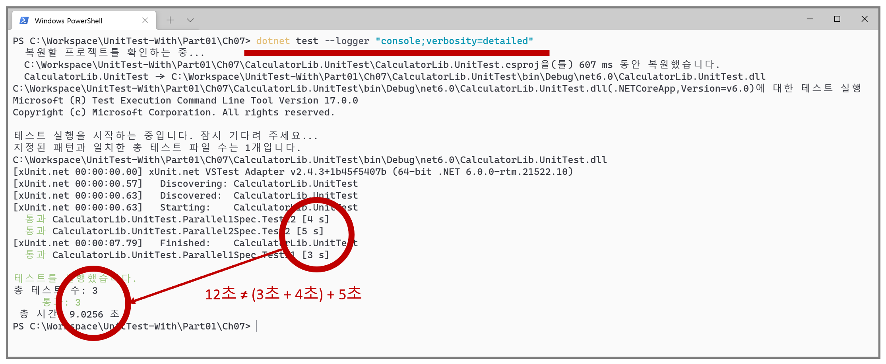

# 단위 테스트 병렬 실행


- 단위 테스트는 클래스 단위로 동시 실행한다.
  - 한 클래스에 있는 여러 단위 테스트는 순차적으로 실행한다(직렬).


- 3초와 4초 그리고 5초 `Thread.Sleop`이 있지만 클래스 단위로 테스트가 동시에 실행되기 때문에 총 테스트 시간은 12초 이상을 소요하지 않는다.

## 단위 테스트 로거 명령
```
dotnet test --logger "console;verbosity=detailed"
```