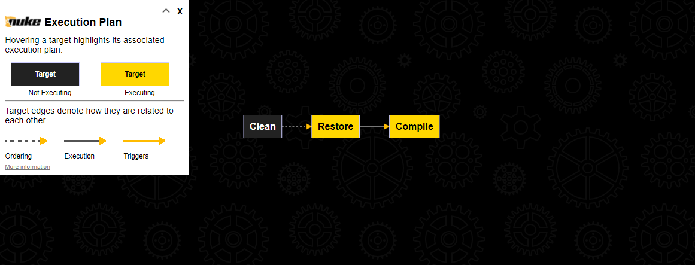

# Nuke 빌드 자동화 구현


| 출력 형식       | 파일 이름               |
|----------------|------------------------|
| json           | coverage.json          |
| lcov           | coverage.info          |
| cobertura      | coverage.cobertura.xml |
| opencover      | coverage.opencover.xml |

```shell
# 1. 패키지 복원
#    - 솔루션 폴더에서 실행 시킨다.
dotnet restore

# 2. 솔루션 빌드
#    - 솔루션 폴더에서 실행 시킨다.
dotnet build `
  --no-restore `
  --configuration Release

# 3. 테스트 수행(필수 패키지 : coverlet.msbuild, JunitXml.TestLogger)
#    - 솔루션 폴더에서 실행 시킨다.
#    - 테스트 프로젝트 폴더를 기준으로 출력 경로가 결정된다(LogFilePath, CoverletOutput).
#    - '{assembly}.xml'은 어셈블리 파일 이름으로 파일을 생성한다.
#    - CoverletOutputFormat의 '%2c'은 ','을 의미한다.
dotnet test `
  --no-build `
  --configuration Release
  --logger "console;verbosity=detailed" `
  --logger "junit;LogFilePath="../artifacts/gitlab/{assembly}.xml";MethodFormat=Class;FailureBodyFormat=Verbose" `
  /p:CollectCoverage=true `
  /p:CoverletOutput="../artifacts/coverage/" `
  /p:CoverletOutputFormat=json `                                # 마지막을 제외한 테스트 프로젝트
  #/p:CoverletOutputFormat=lcov `                               # 마지막 테스트 프로젝트
  #/p:CoverletOutputFormat=json%2clcov%2ccobertura%2copencover
  /p:MergeWith="../artifacts/coverage/coverage.json"

# 4. 코드 커버리지 보고서 생성
reportgenerator `
  -reports:**/artifacts/coverage/coverage.info `                # lcov 통합 코드 커버리지 결과 파일
  -targetdir:./artifacts/coverage/report `
  -reporttypes:Html `
  -historydir:./artifacts/coverage/report-history
```
```cs
// 1. 패키지 복원

// 2. 솔루션 빌드

// 3. 테스트 수행

// 4. 코드 커버리지 보고서 생성

// 5. 클래스 다이어그램 생성

// 6. 코드 정적 분석
//    - MS 오픈소스?
//    - MSBuild .edit...?
```

## Nuke란?
- .NET 솔루션 빌드 자동화를 제공하기 위해 C# 도메인 특화 언어(DSL : Domain-Specific Language)입니다.  
  `The cross-platform build automation solution for .NET with C# DSL.`  
- 도메인 지식(빌드)에 집중할 수 있는 환경(언어 : 클래스, 도구 : VS, VSCode, ...)을 제공합니다.

## Nuke 사용 목적
- 빌드를 코드로 문서화(자동화)한다.
- GitLab과 GitHub 등 외부 CI 의존성을 최소화시킨다.
- CI 서버와 Local 빌드를 통일 시킨다.
 
## Nuke 설치
- .NET Tool 설치
  ```shell
  # 설치
  dotnet tool install --global Nuke.GlobalTool

  # 확인
  dotnet tool list --global
  ```
- VSCode 확장 도구 설치
  - [NUKE Support](https://marketplace.visualstudio.com/items?itemName=nuke.support)

## Nuke 빌드 프로젝트 생성
```
# 기본적으로 솔루션 파일이 있는 폴더에서 실행시킨다.
nuke :setup
NUKE Global Tool version 6.0.1 (Windows,.NETCoreApp,Version=v3.1)
Could not find root directory. Falling back to working directory ...
```

| 템플릿 질문 | 설명 | 기본 값 | 선택 값 |
|---|---|---|---|
| How should the build project be named?                | 빌드 솔루션 파일명     | `_build`  |       |
| Where should the build project be located?            | 빌드 솔루션 위치       | `./build` |       |
| Which NUKE version should be used?                    | Nuke 버전             | `6.0.1`   |       |
| Which solution should be the default?                 | 빌드 대상 솔루션 선택   |          | `.sln` |
| Do you need help getting started with a basic build?  | 빌드 기본 코드         |           |        |
| Restore, compile, pack using ...                      | 빌드 도구 선택         |           | `dotnet CLI`, `MSBuild/Mono` |
| Source files are located in ...                       | 소스 폴더 선택         |           | `./source`, `./src` |
| Move packages to ...                                  | 패키지 폴더 선택       |           | `./output`, `./artifacts` |
| Where do test projects go?                            | 테스트 소스 폴더 선택   |          | `./tests` |
| Do you use git?                                       | Git 사용 유/무 선택    |          |         |
| Do you use GitVersion?                                | GitVersion 선택        |          |         |

```
How should the build project be named?
»                 [default: _build]
Where should the build project be located?
»                 [default: ./build]
Which NUKE version should be used?
»  6.0.1 (latest release)
Which solution should be the default?
»  {찾은 솔루션 파일명}.sln
   None
Do you need help getting started with a basic build?
»  Yes, get me started!
   No, I can do this myself...
Restore, compile, pack using ...
»  dotnet CLI
   MSBuild/Mono
   Neither
Source files are located in ...
»  ./source
   ./src
   Neither
Move packages to ...
»  ./output
   ./artifacts
   Neither
Where do test projects go?
»  ./tests
   Same as source
Do you use git?
»  Yes, just not setup yet
   No, something else
Do you use GitVersion?
»  Yes, just not setup yet
   No, custom versioning
```
- 생성되는 파일 목록
  - `build` 폴더 : build 소스 폴더
  - `build.cmd` 파일 : build.ps1 실행을 위한 파일
  - `build.ps1` 파일 : Windows에서 build 프로젝트 실행을 위한 스크립트 파일
  - `build.sh` 파일 : Linux에서 build 프로젝트 실행을 위한 스크립트 파일
  - `.nuke` : nuke 관리 폴더
- 생성된 파일 목록 확인
  ```git
  git status -s -uall
  ```

## Nuke 소스 구성
```cs
// 실행 Target 지정
public static int Main () => Execute<Build>(x => x.Compile);

// 솔루션 파일
[Solution] readonly Solution Solution;

// IsServerBuild
// IsLocalBuild
readonly Configuration Configuration = IsLocalBuild ? Configuration.Debug : Configuration.Release;

Target Clean => _ => _
    .Before(Restore)
    .Executes(() =>
    {
        // ...
    });

Target Restore => _ => _
    .Executes(() =>
    {
        // ...
    });

Target Compile => _ => _
    .DependsOn(Restore)
    .Executes(() =>
    {
        // ...
    });
```

### Parameter 추가
```cs
[Parameter("Hello Parameter")]
readonly string Hello;
```
```
.\build.cmd --help

Parameters:
  --hello                 Hello Parameter.
```

### 로그 출력
```cs
using Serilog;

Log.Information("로그 출력");
```
```shell
15:27:04 [INF] 로그 출력
```

### 코드 커버러지 통합
```cs
void RunTest(string project, CoverletOutputFormat format)
{
    DotNetTest(_ => _
            .SetProjectFile(project)

            // --configuration
            .SetConfiguration(Configuration)

            // ? architecture

            // --logger
            .SetLoggers(
                "console;verbosity=detailed",
                "junit;LogFilePath=" + ArtifactsDirectory + "/gitlab/{assembly}.xml;MethodFormat=Class;FailureBodyFormat=Verbose")

            .SetCoverletOutputFormat(format)
            .SetProcessArgumentConfigurator(args => args
                .Add("/property:CollectCoverage=true")
                .Add("/property:CoverletOutput={0}/", ArtifactsDirectory / "coverage")
                .Add("/property:MergeWith=\"{0}\"", ArtifactsDirectory / "coverage" / "coverage.json")));

    // TODO
    // SetExcludeByFile
    // SetUseSourceLink

    // NOT TODO
    // .SetCoverletOutput(ArtifactsDirectory / "coverage//")
}

Target Test => _ => _
    .DependsOn(Compile)
    .Executes(() =>
    {
        var projects = GlobFiles(RootDirectory, "**/*.*Test.csproj");

        projects
            .SkipLast(1)
            .ForEach(project =>
                RunTest(project, CoverletOutputFormat.json));

        RunTest(projects.Last(), CoverletOutputFormat.lcov);
    });
```
```
dotnet test ...1.csproj /p:CollectCoverage=true  /p:CoverletOutput="../CoverageResults/"
dotnet test ...2.csproj /p:CollectCoverage=true  /p:CoverletOutput="../CoverageResults/" /p:MergeWith="../CoverageResults/coverage.json"
dotnet test ...3.csproj /p:CollectCoverage=true  /p:CoverletOutput="../CoverageResults/" /p:MergeWith="../CoverageResults/coverage.json" /p:CoverletOutputFormat="opencover"
```

## Nuke 명령
- `--help` : 도움말
- `--plan` : Target 시각화
  

## Nuke FAQ
- 빌드 코드의 IntelliSense가 정상동작하지 않을 때
  - `./build` 프로젝트 위치에서 VSCode 열기한다.
  - `./build` 프로젝트 위치에서 VSCode을 열면 정상적으로 `IntelliSense`가 동작한다.
- 실행하기
  ```shell
  # Case 1. 파일 실행
  ./build.cmd
  ./build.cmd --configuation Release

  # Case 2. Nuke 실행
  nuke
  nuke --configuation Release
  ```
- `[WRN] : Could not complete checking build configurations within 500 milliseconds` 경고 메시지 제거하기
  - 변경 전
    ```cs
    [CheckBuildProjectConfigurations]
    ```
  - 변경 후
    ```cs
    [CheckBuildProjectConfigurations(TimeoutInMilliseconds = 2000)]
    ```
- 복수 솔루션 파일 처리하기
  - 변경 전
    ```cs
    [Solution()] readonly Solution Solution;
    ```
  - 변경 후
    ```cs
    [Solution("src1/Sample1.sln")] readonly Solution Solution1;
    [Solution("src2/Sample2.sln")] readonly Solution Solution2;
    ```
- 패키지 미싱
  ```
  System.ApplicationException: Missing package reference/download.
  Run one of the following commands:
    - nuke :add-package coverlet.console --version 3.1.2
   ---> System.ArgumentException: Could not find package 'coverlet.console' using:
  ```
  ```
  System.ApplicationException: Missing package reference/download.
  Run one of the following commands:
    - nuke :add-package ReportGenerator --version 5.0.4
   ---> System.ArgumentException: Could not find package 'ReportGenerator' using:
  ```
  - 변경 전
  - 변경 후
    ```xml
    <ItemGroup>
      <PackageReference Include="Nuke.Common" Version="6.0.1" />
      <PackageReference Include="plantumlclassdiagramgenerator" Version="1.2.4" />
      <PackageReference Include="ReportGenerator" Version="5.0.4" />
    </ItemGroup>
    ```
- 패키지 호환성
  ```
  C:\Temp\dotnet-ci\build\_build.csproj : error NU1202: coverlet.console 3.1.2 패키지가 net6.0(.NETCoreApp,Version=v6.0)과(와) 호환되지 않습니다.
                                          coverlet.console 3.1.2 패키지는 다음을 지원합니다. net5.0(.NETCoreApp,Version=v5.0) / any
  C:\Temp\dotnet-ci\build\_build.csproj : error NU1212: coverlet.console 3.1.2에 대한 잘못된 프로젝트-패키지 조합입니다.
                                          DotnetToolReference 프로젝트 스타일에는 DotnetTool 형식의 참조만 포함할 수 있습니다.
  ```
  ```
  C:\ ... \_build.csproj : error NU1202: GitVersion.Tool 5.8.2 패키지가 net6.0(.NETCoreApp,Version=v6.0)과(와) 호환되지 않습니다.
                           GitVersion.Tool 5.8.2 패키지는 다음을 지원합니다.
  C:\ ... \_build.csproj : error NU1202:   - net5.0(.NETCoreApp,Version=v5.0) / any
  C:\ ... \_build.csproj : error NU1202:   - net6.0(.NETCoreApp,Version=v6.0) / any
  C:\ ... \_build.csproj : error NU1202:   - netcoreapp3.1(.NETCoreApp,Version=v3.1) / any
  C:\ ... \_build.csproj : error NU1212: GitVersion.Tool 5.8.2에 대한 잘못된 프로젝트-패키지 조합입니다.
                           DotnetToolReference 프로젝트 스타일에는 DotnetTool 형식의 참조만 포함할 수 있습니다.
  ```
  - 변경 전
    ```xml
    <PackageReference Include="plantumlclassdiagramgenerator" Version="1.2.4" />
    ```
  - 변경 후
    ```xml
    <PackageReference Include="plantumlclassdiagramgenerator" Version="1.2.4">
      <ExcludeAssets>all</ExcludeAssets>
    </PackageReference>
    <PackageReference Include="GitVersion.Tool" Version="5.8.2">
      <ExcludeAssets>all</ExcludeAssets>
    </PackageReference>
    ```
    - `<ExcludeAssets>all</ExcludeAssets>` : TODO
    - `<IncludeAssets>runtime</IncludeAssets>` : TODO
    - `<PrivateAssets>all</PrivateAssets>` : TODO
- 패키지 찾기 실패
  ```
  19:09:10 [WRN] Exception has been thrown by the target of an invocation.
  System.Reflection.TargetInvocationException: Exception has been thrown by the target of an invocation.
   ---> System.ArgumentException: Could not find 'puml-gen.exe' inside 'C:\ ... \plantumlclassdiagramgenerator\1.2.4' (Parameter 'packageExecutablePaths')
  ```
  - 변경 전
  - 변경 후
    - TODO?
- 임의 Tool
  - 변경 전
  - 변경 후
    - TODO? : .NET Tool 연동 이해 : Class Diagram 생성

## 참고 자료
- [Escalating Automation - The Nuclear Option](https://blog.dangl.me/archive/escalating-automation-the-nuclear-option/)
- [Cross-platform Build Automation with Nuke](https://dev.to/damikun/the-cross-platform-build-automation-with-nuke-1kmc)

## 참고 소스
- [LibHac](https://github.com/Thealexbarney/LibHac/blob/master/build/Build.cs)
- [Singularity](https://github.com/Barsonax/Singularity/blob/master/_build/Build.cs)
- [Eventfully](https://github.com/cfrenzel/Eventfully/blob/master/build/Build.cs)
- [LogExpert](https://github.com/zarunbal/LogExpert/blob/master/build/Build.cs)

## 참고 동영상
- [Nuke — Designing a Build System with IDE Support in Mind](https://www.youtube.com/watch?v=N57Zjb5-08I)
- [NUKE - C# Build Automation System - Overview & Tutorial](https://www.youtube.com/watch?v=V5m4yPMjCtY)
- [NUKE: Build automation for C# developers](https://www.youtube.com/watch?v=7gEqxzD6hbs)
