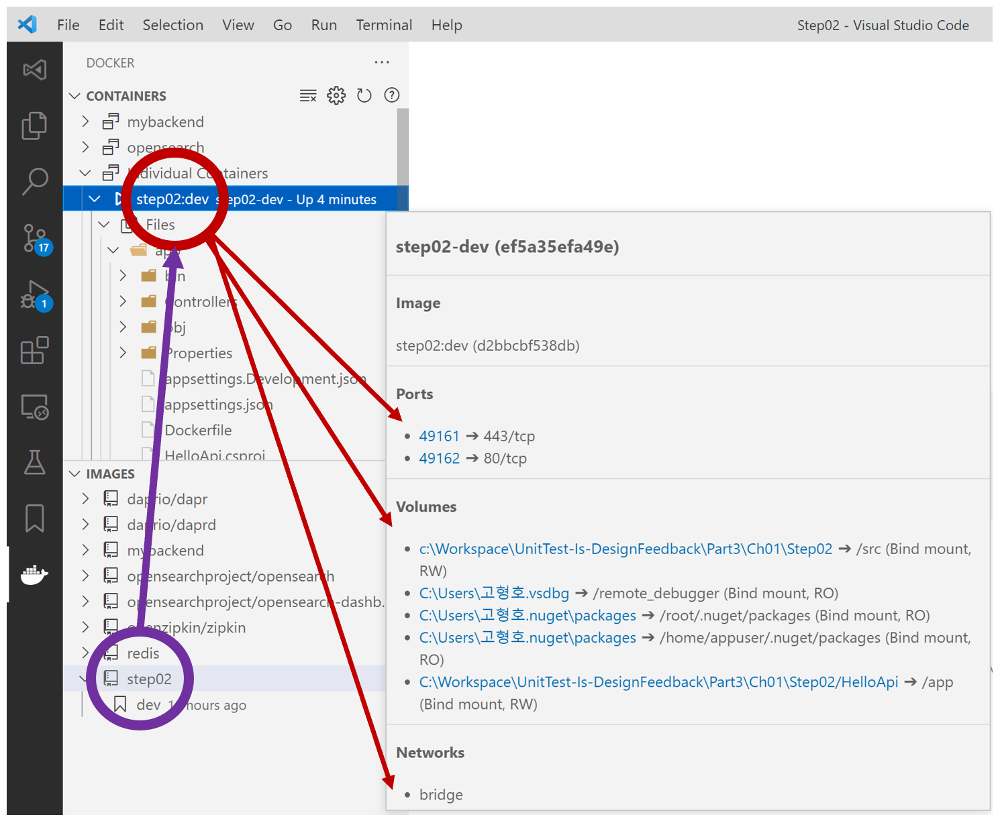
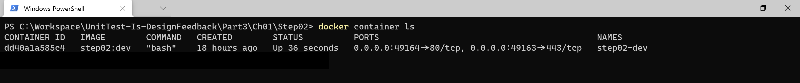
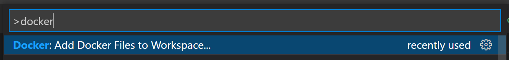

# WebAPI 컨테이너 디버깅




## 컨테이너 디버깅 확장 도구
- Docker 확장 도구 설치
  - https://marketplace.visualstudio.com/items?itemName=ms-azuretools.vscode-docker

## 컨테이너 디버깅 설정
- Docker 파일 생성
    
  - Ctrl + Shift + P : `Docker: Add Docker Files to Workspace...` > `.NET: ASP.NET Core` > `Linux` > `80, 443` > `No`
    - `Dockerfile` 생성됨
    - `launch.json` 추가됨
    - `tasks.json` 추가됨
- `launch.json` 파일 수정 : `dockerServerReadyAction` 추가
  ```json
  {
      "name": "Docker .NET Core Launch",
      ... ,
      "dockerServerReadyAction": {
          "uriFormat": "%s://localhost:%s/swagger"
      }
  }
  ```
  - 디버깅할 때 자동으로 WebAPI 디버깅을 위한 Swagger 페이지을 자동 열기한다.
- `tasks.json` OS 설정 변경
  ```json
  {
      "type": "docker-run",
      ... ,
      "dockerRun": {
          "os": "Linux"
      },
      ...
  },
  {
      "type": "docker-run",
      ... ,
      "dockerRun": {
          "os": "Linux"
      },
      ...
  }
  ```

## 컨테이너 디버깅 이해
- `Docker .NET Core Launch` 실행 순서
  - launch.json
    - Docker .NET Core Launch" : `preLaunchTask": "docker-run: debug`,
  - tasks.json
    - "docker-run: debug" : `"dependsOn": [ "docker-build: debug" ]`
    - "docker-build: debug" : `"dependsOn": [ "build" ],`
    - "build"
- 컨테이너 이미지
  - Debug : `step02:dev`
  - Relase : `step02:latest`

```shell
# task : build
> Executing task: C:\Program Files\dotnet\dotnet.exe
    build
    C:\Workspace\UnitTest-Is-DesignFeedback\Part3\Ch01\Step02/HelloApi/HelloApi.csproj
    /property:GenerateFullPaths=true
    /consoleloggerparameters:NoSummary <

# task : docker-build: debug
> Executing task: docker-build: debug <
> docker build
    --rm -
    -pull
    -f "C:\Workspace\UnitTest-Is-DesignFeedback\Part3\Ch01\Step02/HelloApi/Dockerfile"
    --label "com.microsoft.created-by=visual-studio-code"
    -t "step02:dev"
    --target "base"
    "C:\Workspace\UnitTest-Is-DesignFeedback\Part3\Ch01\Step02" <

# task : docker-run: debug
> Executing task: docker-run: debug <
> docker run
    -dt
    -P
    --name "step02-dev"
    -e "DOTNET_USE_POLLING_FILE_WATCHER=1"
    -e "ASPNETCORE_ENVIRONMENT=Development"
    --label "com.microsoft.created-by=visual-studio-code"
    -v "C:\Workspace\UnitTest-Is-DesignFeedback\Part3\Ch01\Step02/HelloApi:/app:rw,z"
    -v "c:\Workspace\UnitTest-Is-DesignFeedback\Part3\Ch01\Step02:/src:rw,z"
    -v "C:\Users\고형호\.vsdbg:/remote_debugger:ro,z"
    -v "C:\Users\고형호\.nuget\packages:/root/.nuget/packages:ro,z"
    -v "C:\Users\고형호\.nuget\packages:/home/appuser/.nuget/packages:ro,z"
    "step02:dev" <
```